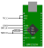

Subdirectory _[efm32s2]_ contains a preliminary OpenOCD flash driver for Silicon Laboratories EFM32 series 2 MCUs, like EFM32PG22,
or EFR32FG23, based on OpenOCD's driver for series 0 and 1 MCUs, [efm32][efm32c],
which has been adapted as far as necessary for basic functionality.
Features other than flashing or debugging, like page locking,
may still not work correctly, this hasn't been tested yet.

Some functionality for enabling debug lock and issuing a device reset via DCI to lock/unlock a device
has been implemented in efm32s2.cfg, and the tcl will attempt to notify the user if the device is locked.
Also this implementation can serve as a good reference for implementing the mechanisms described in SiLabs
appnotes [AN1303] and [AN1190].

[efm32s2]: ./efm32s2
[efm32c]: https://github.com/openocd-org/openocd/blob/1c22c5a82b248b7209fdc904e733b9fa29307c48/src/flash/nor/efm32.c
[AN1190]: https://www.silabs.com/documents/public/application-notes/an1190-efr32-secure-debug.pdf
[AN1303]: https://www.silabs.com/documents/public/application-notes/an1303-efr32-dci-swd-programming.pdf

A number of details are different in series 2, as compared to series 0 and 1:

-	Device Info registers for page, flash and ram sizes are located at different offsets.
-	MSC `WRITECMD` and `ADDRB` registers are located at different offsets,
	which made an adjustment of the flash write assembly code neccessary.
-	To be able to use the MSC peripheral, its clock must be enabled in the CMU.
-	The RAM starts at a different address, 0x2... instead of 0x1....
-	Flash base address is not 0x0 but 0x08000000 for EFR32xG23 (but still 0x0 for xG22).
-	Debug/device lock/erase has now moved to its own SWD AP called DCI.

Since the work area address (i.e. the start of ram) gets configured in tcl/target/efm32.cfg,
it has been decided to create a new `efm32s2` target in tcl/target/efm32s2.cfg,
and to derive a separate flash driver `efm32s2.c` from `efm32.c`.
It is not clear yet, if it would make sense to integrate series 2 support into the original efm32 driver,
instead of keeping it separate.

[EFM32PG22]: https://www.silabs.com/mcu/32-bit/efm32pg22-series-2

## Setup OpenOCD sources

In this project's working directory, run `sh setup-openocd-src.sh`,
or alternatively, follow these steps:

Clone OpenOCD's official Github mirror repository:

	git clone https://github.com/openocd-org/openocd
	cd openocd

Checkout a revision compatible to this EFM32 series 2 extension:

	git checkout 2e60e2e

... which sets the OpenOCD source directory to where this author last tested building. Bumping further might work, but YMMV.

Initialize submodules:

	git submodule init
	git submodule update

Still inside the ./openocd subdirectory,
copy files from the _efm32s2_ subdirectory to their positions in the openocd source tree,
and apply the patch:

	cp ../efm32s2/efm32s2.c src/flash/nor/
	cp ../efm32s2/efm32s2.cfg tcl/target/
	patch -p1 < ../efm32s2/adjust_openocd.patch

The OpenOCD tree is now ready to be built.

## Build on Linux

Prerequisites:

	make autoconf libtool
	gcc git
	libusb-dev libftdi-dev

For a minimal setup, with most drivers disabled except CMSIS-DAP and FTDI/MPSSE,
run

	sh build.sh

If _configure_ complains about missing dependencies,
or CMSIS-DAP is not marked _yes_ in the _configuration summary_,
install the missing pieces, and run build.sh again.

## Run a test using CMSIS-DAP

If the build succeeded,
a minimal installation may be created in the _dist_ subdirectory
by running inside this project's working directory:

	sh mkdist.sh

To test whether it works, run `ident.sh` in the dist subdirectory.
A CMSIS-DAP capable device,
connect to the target MCU,
needs to be attached to a local USB port.
The [Particle Debugger], for instance,
has worked for debugging using GDB
and flashing without any problems.

	cd dist
	sh ident.sh

The output should contain lines like:

	Info : detected part: PG22C200, rev 17
	Info : flash size = 256kbytes
	Info : flash page size = 8192bytes

[Particle Debugger]: https://docs.particle.io/datasheets/accessories/debugger/

### Using an FTDI device instead

Alternatively, instead of CMSIS-DAP the `ftdi` driver may be used with an FTDI device with MPSSE mode.
Support has been added for FT232H,
which is part of e.g. [UM232H].
To use the ftdi interface in [dist/_iface.sh],
comment out the line `iface=ftdi_ft232h`.

The following wiring has been used successfully with an EFM32PG22 and UM232H:

Note: While the other Pins are connected directly,
between TDI and SWDIO a resistor must be placed,
as stated in [swd-resistor-hack.cfg].
For the above setup, 470 Ω has been found to work (while 1 kΩ didn't).

To get the FTDI approach to run on Windows,
the default FTDI driver has to be replaced with WinUSB by a tool like [zadig].

[UM232H]: https://ftdichip.com/wp-content/uploads/2020/07/DS_UM232H.pdf#page=10
[dist/_iface.sh]: dist/_iface.sh
[swd-resistor-hack.cfg]: https://github.com/openocd-org/openocd/tree/master/tcl/interface/ftdi/swd-resistor-hack.cfg 
[zadig]: https://github.com/pbatard/libwdi/releases

## Build a Windows binary on Linux

See the [./windows](./windows) subdirectory for details.
